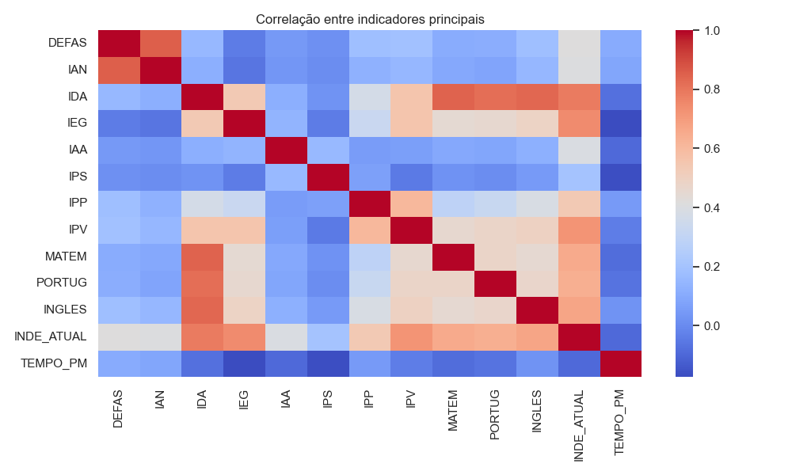

# Análise Exploratória de Dados (EDA)

Abaixo estão os principais insights extraídos do notebook de análise.

### Perfil de Defasagem
O gráfico abaixo mostra a evolução das faixas de defasagem entre 2022 e 2024.

### Relação Engajamento vs Desempenho
Observamos que alunos com baixo IEG (Engajamento) tendem a apresentar maior risco de defasagem.

### Correlação de Indicadores
