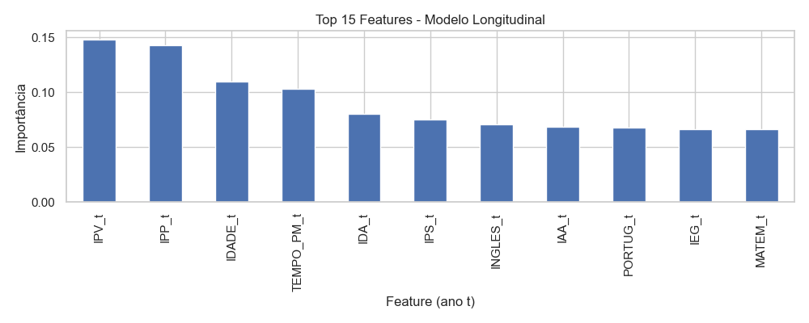

# Modelagem Preditiva

Utilizamos o algoritmo **XGBoost Classifier** para dois cenários distintos.

## 1. Modelo Transversal (Risco Atual)
Focado em identificar alunos que já estão em situação crítica no ano corrente.

**Performance:**

### Principais Drivers
Os indicadores que mais influenciam o risco atual são:

## 2. Modelo Longitudinal (Risco Futuro)
Modelo diferencial que utiliza dados do ano anterior para prever a situação do ano seguinte.
